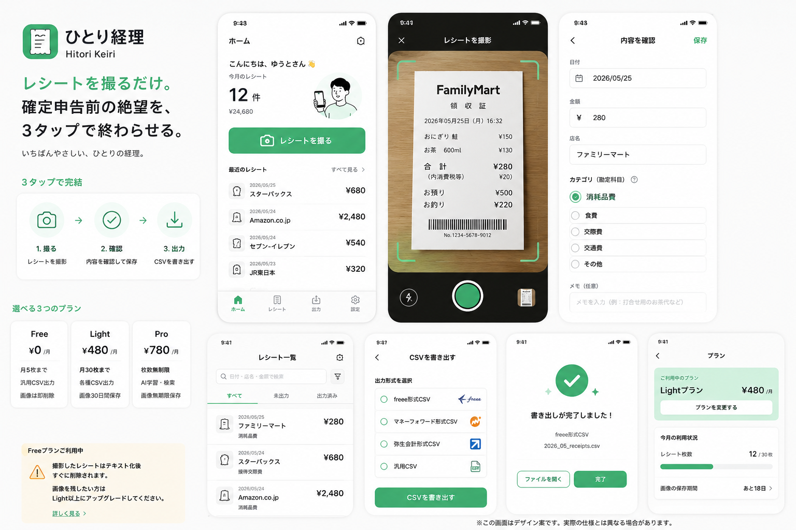

# デザイン資産

ひとり経理(Hitori Keiri)のUIデザイン関連アセットを保管する。確定したビジュアル方針は[第4章 4.9](../requirements/04-screen-design.md#49-ビジュアルデザイン確定)を参照。

## 確定UIモック(v1)

検討した3案(A やさしいミニマル / B 絶望からの解放 / C 暮らしに寄り添う)から、**デザインA「やさしいミニマル」をベースに確定**したモック。

- テーマ: ライトテーマ(白基調 + グリーンアクセント)
- ロゴ: 緑のレシートアイコン +「ひとり経理 / Hitori Keiri」
- コピー: A案(絶望訴求)を主見出し、B案(いちばんやさしい)を補助
- 収録画面: ホーム / 撮影 / 内容確認 / レシート一覧 / CSV出力 / 書き出し完了 / プラン / Free画像削除バナー / 料金プラン(Free・Light・Pro)

## ファイル一覧

| ファイル | 内容 | 状態 |
|---|---|---|
| `assets/image-keiri-design.png` | 確定UIモック(全画面まとめ) | 採用 |

## 実装反映メモ

- 2026-05-26: 確定UIモック v1 をもとに、ホーム / 撮影 / 内容確認 / レシート一覧 / CSV出力 / プラン画面の表示をアプリ側へ反映。
- 現時点ではビジュアル反映が中心。実カメラプレビュー、出力済み状態、課金購入フローなどの機能差分は今後の実装タスクで扱う。

> 過去の比較検討用 3案(A/B/C 並置)の画像は、残す場合 `assets/ui-mockup-options-3patterns.png` 等として追加する。
